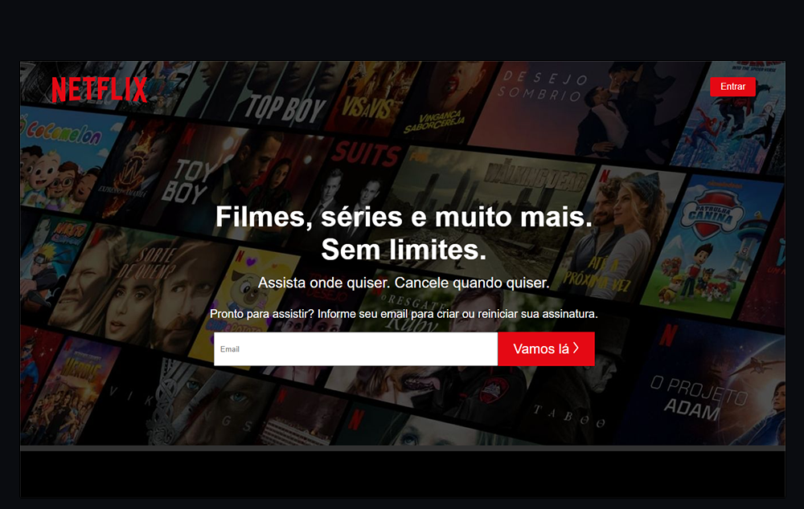

# Web-Page-Clone-Netflix
<b>> Página de inicio da netflix</b>
Desenvolvido atraves das aulas  Programador do Zero com Rodolfo Mori no Youtube.

O projeto foi desenvolvido com as seguintes tecnologias:

- [x] HTML
- [x] CSS
- [x] JavaScript

Resultado: 

## 🤝 Colaboradores

Pessoa que contribuiu para este projeto:

<table>
  <tr>
    <td align="center">
         
        
          <b> Felipe Silva </b>
        
      </a>
    </td>
   </tr>
</table>
